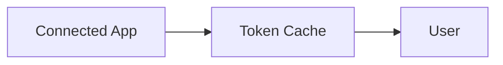

# FRAPPE_AUTH_INFRASTRUCTURE.md (Template)

> Fill this template with verified code-level findings. Replace all placeholders (`TODO`, `<...>`) and remove sections marked N/A only if truly not applicable.

---

## 1. Executive Summary

**Audited version:** `<v14|v15|other>`  
**Git SHA:** `<commit_sha>`  
**Audit date:** `<YYYY-MM-DD>`

Provide a concise paragraph covering:
- Current maturity of Frappe auth/integration stack
- What is production-ready vs scaffold-level
- Immediate fit for HUF integration goals

**Quick verdict:**
- **Production-ready components:** `TODO`
- **Requires extension:** `TODO`
- **Should be rebuilt/custom:** `TODO`

---

## 2. OAuth 2.0 Implementation Deep Dive

### 2.1 Supported Flows

| Flow | Supported? | Entry Point | Core Functions | Parameters | Return Shape | Notes |
|------|------------|-------------|----------------|------------|--------------|-------|
| Authorization Code | `TODO` | `TODO` | `TODO` | `TODO` | `TODO` | `TODO` |
| PKCE | `TODO` | `TODO` | `TODO` | `TODO` | `TODO` | `TODO` |
| Client Credentials | `TODO` | `TODO` | `TODO` | `TODO` | `TODO` | `TODO` |
| Implicit | `TODO` | `TODO` | `TODO` | `TODO` | `TODO` | `TODO` |

**Evidence references**
- `TODO file:line`
- `TODO file:function_name()`

### 2.2 Token Lifecycle

#### Storage
- Access token storage DocType/table: `TODO`
- Refresh token storage DocType/table: `TODO`
- Authorization code storage DocType/table: `TODO`

#### Issuance & Refresh
- Token issue path: `TODO`
- Refresh path: `TODO`
- Auto-refresh behavior: `TODO`

#### Expiry, Revocation, Cleanup
- Expiry checks: `TODO`
- Revocation logic: `TODO`
- Cleanup jobs/tasks: `TODO`

#### Security Notes
- Encryption at rest: `TODO`
- Secret exposure risks: `TODO`

### 2.3 Endpoint Mapping

| Endpoint | Method | Handler | Purpose | Auth Required | Notes |
|----------|--------|---------|---------|---------------|-------|
| `/api/method/frappe.integrations.oauth2.authorize` | `GET` | `oauth2.authorize()` | Authorization request | `TODO` | `TODO` |
| `TODO` | `TODO` | `TODO` | `TODO` | `TODO` | `TODO` |

---

## 3. Credential & Secret Storage

### 3.1 Password Field Implementation

- Internal behavior of `Password` fieldtype: `TODO`
- Encryption/hashing implementation path(s): `TODO`
- Suitability for API keys/OAuth secrets: `TODO`

**Key references**
- `TODO`

### 3.2 Token Cache DocType

- Schema summary: `TODO`
- User/app linkage model: `TODO`
- Encryption or obfuscation behavior: `TODO`

### 3.3 Security Assessment (for HUF)

| Area | Current State in Frappe | Risk | Recommendation |
|------|--------------------------|------|----------------|
| Credential storage | `TODO` | `TODO` | `TODO` |
| Token refresh | `TODO` | `TODO` | `TODO` |
| Multi-tenant isolation | `TODO` | `TODO` | `TODO` |
| Auditing/observability | `TODO` | `TODO` | `TODO` |

---

## 4. Connected Apps Framework

### 4.1 Architecture Overview

- Connected App DocType summary: `TODO`
- Token Cache relationship: `TODO`
- User scoping model: `TODO`



(Use ASCII diagram if Mermaid unavailable.)

### 4.2 End-to-End Flow (Code-Referenced)

#### 1) Admin creates Connected App
- Steps: `TODO`
- Validation hooks: `TODO`
- Evidence: `TODO`

#### 2) User initiates connection
- Trigger/button handler: `TODO`
- Redirect construction: `TODO`
- Evidence: `TODO`

#### 3) OAuth callback + token exchange
- Callback entry point: `TODO`
- Exchange request/response processing: `TODO`
- Evidence: `TODO`

#### 4) Token storage + retrieval
- Persist path: `TODO`
- Read path: `TODO`
- Evidence: `TODO`

#### 5) Using tokens in API calls
- Helper methods / utility layers: `TODO`
- Typical call pattern: `TODO`
- Evidence: `TODO`

### 4.3 Production Readiness Assessment

**What works out of the box**
- `TODO`

**Known limitations**
- `TODO`

**Enterprise gaps**
- `TODO`

---

## 5. Google Integration Case Study (Anti-Pattern Analysis)

### 5.1 Google Settings Implementation

- Structure summary: `TODO`
- Hardcoded elements: `TODO`
- Configurable elements: `TODO`

### 5.2 Google Calendar Integration

- Auth/token flow summary: `TODO`
- Connected App usage vs bypass: `TODO`

### 5.3 Architectural Critique

- Google-specific coupling points: `TODO`
- Generic abstraction opportunities: `TODO`
- HUF-oriented replacement pattern: `TODO`

---

## 6. Integration Target Assessment

### Consolidated Matrix

| Target | Auth Flow Type | Frappe Fit | Token Strategy | Multi-tenant Notes | Refresh Strategy | Verdict |
|--------|----------------|-----------|----------------|--------------------|------------------|---------|
| Slack | `TODO` | `TODO` | `TODO` | `TODO` | `TODO` | `Reuse/Extend/Custom` |
| ClickUp | `TODO` | `TODO` | `TODO` | `TODO` | `TODO` | `Reuse/Extend/Custom` |
| Gmail | `TODO` | `TODO` | `TODO` | `TODO` | `TODO` | `Reuse/Extend/Custom` |
| Meta Messenger | `TODO` | `TODO` | `TODO` | `TODO` | `TODO` | `Reuse/Extend/Custom` |
| Odoo | `TODO` | `TODO` | `TODO` | `TODO` | `TODO` | `Reuse/Extend/Custom` |

### 6.1 Slack
- Capability comparison: `TODO`
- Verdict + rationale: `TODO`

### 6.2 ClickUp
- Capability comparison: `TODO`
- Verdict + rationale: `TODO`

### 6.3 Gmail
- Capability comparison: `TODO`
- Verdict + rationale: `TODO`

### 6.4 Meta Messenger
- Capability comparison: `TODO`
- Verdict + rationale: `TODO`

### 6.5 Odoo
- Capability comparison: `TODO`
- Verdict + rationale: `TODO`

---

## 7. Decision Framework

```text
IF service uses standard OAuth 2.0 Authorization Code:
  → Use Connected App directly
  → Extend with: <TODO>

IF service requires PKCE:
  → Check support: <TODO>
  → If supported: Use Connected App + <TODO>
  → If unsupported: Build wrapper/custom flow

IF service uses API Key / Bearer token only:
  → Skip Connected App
  → Use: <TODO>

IF service requires webhook verification:
  → Use: <TODO>
```

Add optional decision matrix if needed.

---

## 8. Code Examples

> Ensure examples are either directly runnable or clearly labeled pseudocode.

### 8.1 Using Connected App Tokens in Code

```python
# TODO: replace with verified pattern from audited code
```

### 8.2 Extending Connected App for Custom Flow

```python
# TODO: replace with extension pattern
```

### 8.3 Building Custom Integration (Bypassing Connected App)

```python
# TODO: replace with custom integration scaffolding pattern
```

---

## 9. Appendices

### A. DocType Schema Dumps

Include relevant JSON schema excerpts for:
- `OAuth Client`
- `OAuth Bearer Token`
- `OAuth Authorization Code`
- `OAuth Provider Settings`
- `OAuth Scope`
- `OAuth Client Role`
- `OAuth Settings`
- `Connected App`
- `Token Cache`

### B. Method Signatures

List public methods and core private methods with signatures and short descriptions.

### C. Database Tables and Column Mapping

| DocType | Table | Key Columns | Notes |
|---------|-------|-------------|-------|
| `TODO` | `TODO` | `TODO` | `TODO` |

---

## Uncertainties / Needs Verification

- `NEEDS VERIFICATION: TODO`
- `NEEDS VERIFICATION: TODO`

---

## Source Reference Log

> Keep this section updated while researching.

- `TODO file:line - finding`
- `TODO file:function_name() - finding`
