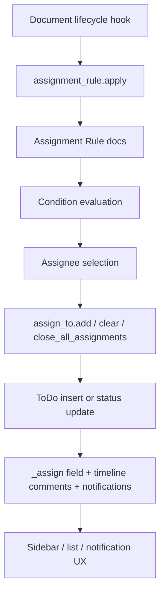
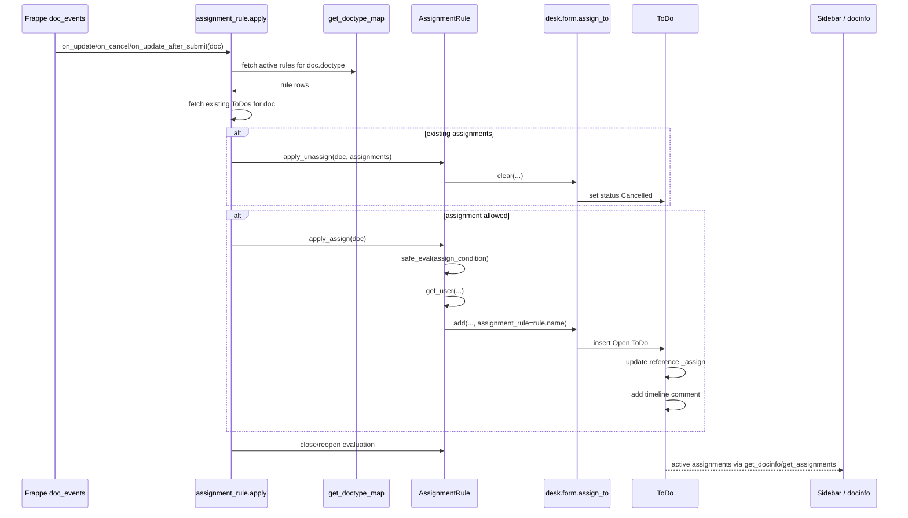
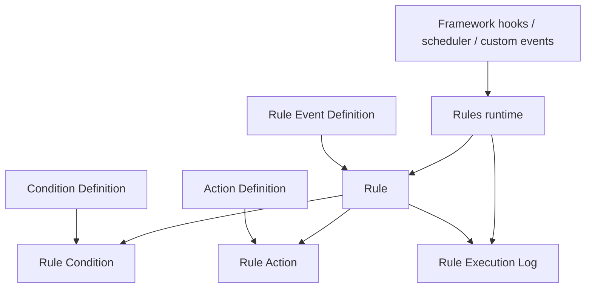

# Assignment Rule in Frappe: Deep Technical Documentation and a Rules-App Design Proposal

## 1. Executive Summary

Frappe's **Assignment Rule** is a focused automation mechanism that evaluates document state changes and, when a configured expression matches, creates or updates **ToDo-based assignments** for a target user. It lives in the framework's generic document event pipeline, not inside any one business app, and is therefore available to arbitrary DocTypes except `ToDo` itself.

The implementation is intentionally narrow:

- its trigger model is tied mainly to framework document lifecycle hooks (`on_update`, `on_cancel`, `on_update_after_submit`),
- its condition model is limited to single Python expressions stored in `Code` fields,
- its action model is effectively just **assign / unassign / close assignment**, and
- its persistence model is delegated to the existing **ToDo** and assignment sidebar infrastructure.

That narrowness is also why Assignment Rule is strategically important. It already demonstrates several pieces a general rules engine would need:

- event interception via Frappe hooks,
- cached rule lookup by DocType,
- expression evaluation against document context,
- action execution with side effects,
- audit-ish traces via timeline comments and notification logs,
- limited round-robin/load-balancing state.

Its main limitations are structural rather than cosmetic: there is no generalized event registry, no reusable condition catalog, no action composition, no branching/chaining model, no first-class execution log, and no robust debugging/test mode. Those gaps make Assignment Rule a useful seed for a broader automation platform, but not a substitute for one.

---

## 2. Functional Overview of Assignment Rule

From a product perspective, Assignment Rule lets an administrator declare:

1. **which DocType** should be monitored,
2. **when** documents of that type should be assigned,
3. **who** should receive the assignment, and
4. **when existing assignments should be cleared or closed**.

### What it allows users to do

A System Manager can define a rule such as:

- “When an `Issue` is `Open` and `issue_type == 'Bug'`, assign it to one support user at a time.”
- “When a custom document becomes submitted (`docstatus == 1`), assign it to a reviewer.”
- “When a document becomes invalid/closed/cancelled, cancel or close the assignment.”
- “Use the value in a document field (for example `owner` or a `User` link field) as the assignee.”

### What records it can work on

Assignment Rule works on any DocType except `ToDo`.

That exclusion is enforced twice:

- in the client form query, which filters `document_type != 'ToDo'`, and
- in server-side validation, which throws if the rule targets `ToDo`.

### Supported assignment patterns

The built-in routing strategies are:

- **Round Robin**: rotate across an ordered list of users.
- **Load Balancing**: choose the user with the fewest open `ToDo` assignments for that same reference DocType.
- **Based on Field**: read a field from the document and assign directly to that user if the value exists as a `User` record.

### How it appears in the UI

The Assignment Rule form exposes:

- target DocType,
- optional due-date source field,
- priority,
- description template,
- Python-expression fields for assign/unassign/close,
- assignment days,
- routing rule,
- user list or field selector,
- read-only `last_user` state for round robin.

In list views, users with bulk action privileges can also select records and click **Apply Assignment Rule** to execute the rule logic manually in batch.

### Expected user outcome

When a rule matches, the end user does **not** get a special “Assignment Rule instance” document. Instead, they see the normal Frappe assignment experience:

- one or more `ToDo` records are created or updated,
- the reference document's `_assign` metadata is updated,
- the form sidebar shows assignees,
- timeline assignment comments appear on the document,
- assignees may receive notification log entries,
- the document may be shared automatically if the assignee otherwise lacks access.

Assignment Rule is therefore best thought of as **automation on top of the pre-existing assignment subsystem**, not a standalone workflow engine.

---

## 3. Source Files and Code Map

The feature is spread across more than the three obvious files. The map below follows the actual runtime path.

| Path | Role | Purpose | Category |
|---|---|---|---|
| `frappe/automation/doctype/assignment_rule/assignment_rule.json` | Primary schema | Defines Assignment Rule fields, dependencies, permissions, and layout. | Model/schema |
| `frappe/automation/doctype/assignment_rule/assignment_rule.js` | Form controller | Drives dynamic field options, field descriptions, and assignment-day convenience buttons. | UI |
| `frappe/automation/doctype/assignment_rule/assignment_rule.py` | Primary server logic | Validates rules, evaluates conditions, selects assignees, applies/unassigns/closes assignments, updates due dates, supports bulk apply. | Core logic |
| `frappe/automation/doctype/assignment_rule_day/assignment_rule_day.json` | Child table schema | Stores allowed weekdays for rule execution. | Model/schema |
| `frappe/automation/doctype/assignment_rule_user/assignment_rule_user.json` | Child table schema | Stores configured candidate users. | Model/schema |
| `frappe/hooks.py` | Framework integration | Registers Assignment Rule evaluation on global document lifecycle events. | Integration |
| `frappe/cache_manager.py` | Cache helper | Provides cached doctype-map lookup used to fetch applicable rules by reference DocType. | Helper/integration |
| `frappe/desk/form/assign_to.py` | Assignment API | Creates/cancels/closes `ToDo` assignments, shares docs, follows docs, and enqueues notifications. | Core integration |
| `frappe/desk/doctype/todo/todo.py` | ToDo model | Persists assignments, writes timeline comments, and syncs `_assign` on the reference document. | Core integration |
| `frappe/desk/doctype/todo/todo.json` | ToDo schema | Includes the `assignment_rule` link field stored on generated ToDos. | Model/schema |
| `frappe/desk/form/load.py` | Form load API | Supplies active assignments to form docinfo so the sidebar can render assignees. | UI integration |
| `frappe/public/js/frappe/form/sidebar/assign_to.js` | Assignment sidebar UI | Renders assignees, supports manual add/remove/close actions, and calls assign/remove APIs. | UI integration |
| `frappe/public/js/frappe/form/sidebar/form_sidebar.js` | Sidebar bootstrap | Instantiates the assignment widget on standard forms. | UI integration |
| `frappe/public/js/frappe/list/list_view.js` | List actions | Adds the “Apply Assignment Rule” bulk action to list views. | UI integration |
| `frappe/public/js/frappe/list/bulk_operations.js` | Bulk action client call | Invokes server-side bulk assignment rule application. | UI integration |
| `frappe/core/doctype/communication/communication.py` | Communication integration | Re-applies assignment rules when incoming communication reopens certain parent documents such as Issues. | Integration |
| `frappe/core/doctype/comment/comment.py` | Timeline grouping | Classifies assignment comments under `assignment_logs`. | Integration |
| `frappe/automation/doctype/assignment_rule/test_assignment_rule.py` | Behavioral tests | Encodes expected behavior for round robin, load balancing, due dates, guest inserts, and submittable docs. | Tests |
| `frappe/tests/test_assign.py` | Assignment API tests | Verifies lower-level `assign_to` behavior used by Assignment Rule. | Tests |

### Architectural layering



---

## 4. Data Model and Schema

## 4.1 Assignment Rule DocType

The Assignment Rule schema is deliberately compact. Most of the runtime semantics are encoded by a handful of fields.

| Fieldname | Label | Type | Purpose | UI / Server / Both | Runtime role |
|---|---|---|---|---|---|
| `document_type` | Document Type | Link -> `DocType` | Target DocType to watch. | Both | Used by hook-time rule lookup and by validation. |
| `due_date_based_on` | Due Date Based On | Select | Lets admin pick a source date/datetime field from the target DocType. | Both | Used when creating/updating `ToDo.date`. |
| `priority` | Priority | Int | Sort order among multiple rules for the same DocType. Higher runs first. | Both | `apply()` fetches rules ordered by `priority desc`. |
| `disabled` | Disabled | Check | Turns rule off without deleting it. | Both | Excluded from cached lookup. |
| `description` | Description | Small Text | Jinja template for assignment description. | Both | Rendered into `ToDo.description`. |
| `assign_condition` | Assign Condition | Code (`PythonExpression`) | Boolean expression that triggers assignment. | Both | Evaluated with `frappe.safe_eval`. |
| `unassign_condition` | Unassign Condition | Code (`PythonExpression`) | Boolean expression that cancels existing assignments. | Both | Used by `apply_unassign`. |
| `close_condition` | Close Condition | Code (`PythonExpression`) | Boolean expression that closes existing assignments. | Both | Used by `close_assignments` / close-reopen branch. |
| `assignment_days` | Assignment Days | Table -> `Assignment Rule Day` | Limits rule evaluation to named weekdays. | Both | `is_rule_not_applicable_today()` skips off-day evaluation. |
| `rule` | Rule | Select | Routing algorithm. | Both | Dispatches to round robin, load balancing, or field-based user selection. |
| `field` | Field | Select | Source field when `rule == 'Based on Field'`. | Both | Read from target doc to derive assignee. |
| `users` | Users | Table MultiSelect -> `Assignment Rule User` | Candidate users for round robin / load balancing. | Both | Iterated in selection methods. |
| `last_user` | Last User | Link -> `User` | Stores previous assignee for future round-robin rotation. | Mostly server | Persistent state for `get_user_round_robin()`. |

### Schema-level assumptions

The schema itself encodes several important product assumptions:

1. **One rule targets one DocType.** There is no multi-DocType or reusable rule template concept.
2. **Conditions are independent fields.** Assign, unassign, and close are not modeled as a chain or graph.
3. **User routing is a single strategy enum.** There is no composable candidate filter + selection policy split.
4. **Assignment day scheduling is a weekday allowlist.** There is no time-of-day, timezone-per-rule, holiday calendar, or cron expression.
5. **Round-robin state is stored on the rule itself.** That makes sequencing global per rule, not per team, queue, tenant, or partition key.

## 4.2 Child tables

### `Assignment Rule Day`

A minimal child table with one `Select` field, `day`, storing one of the seven weekday names.

Semantically, it is an allowlist rather than a schedule object. If the table is populated, the rule runs only when the current weekday is present. Duplicate days are rejected by server validation.

### `Assignment Rule User`

A minimal child table with one required `Link` field, `user`, pointing to `User`.

The table is reused in two different ways:

- as an ordered list for **Round Robin**, and
- as a candidate pool for **Load Balancing**.

There is no weight, availability flag, skill tag, capacity limit, or fallback ordering metadata.

## 4.3 Related DocTypes

### `ToDo`

Assignment Rule does not create a separate “assignment execution” record. It uses `ToDo` as the persistent assignment artifact.

Relevant `ToDo` fields include:

- `allocated_to`: assignee,
- `assigned_by`: assigning user,
- `assignment_rule`: back-reference to the originating Assignment Rule,
- `reference_type` / `reference_name`: target document,
- `status`: `Open`, `Closed`, `Cancelled`,
- `date`: due date,
- `description`: human-visible assignment content.

The `assignment_rule` link field is read-only on `ToDo`, reinforcing that it is metadata set by automation or assignment APIs, not something users curate manually.

### `User`

Users participate in several ways:

- as routing candidates,
- as direct assignees via field-based assignment,
- via `enabled` status for notifications,
- via `bulk_actions` permission for bulk apply,
- via `follow_assigned_documents` for auto-follow behavior.

### Reference documents with `_assign`

When `ToDo` rows change, `ToDo.update_in_reference()` writes a JSON array of assignees into the target document's `_assign` field. That field is what many standard Frappe UI surfaces use for assignee display/filtering.

---

## 5. Client-Side / Form Behavior

The Assignment Rule form script is small but high leverage: it restricts invalid choices, reduces admin mistakes, and mirrors server-side assumptions.

## 5.1 Lifecycle hooks used

### `setup`

- Sets a query on `document_type` so `ToDo` cannot be selected in the link picker.
- This is a UX safeguard only; server validation still enforces the rule.

### `refresh`

- Rebuilds the assignment-day shortcut buttons.
- Recomputes dynamic options for `field` and `due_date_based_on`.
- Refreshes the help description for the selected routing rule.

### `document_type`

- Re-runs option generation whenever the target DocType changes.

### `rule`

- Updates the field description for `rule` so the selected strategy is explained inline.

## 5.2 Dynamic behavior

### Assignment day quick buttons

The form adds three convenience buttons on the child table grid:

- `Weekends`
- `Weekdays`
- `All Days`

Clicking one clears the child table and repopulates it with the corresponding weekday rows.

This is purely convenience logic. The real semantic validation happens on the server, which rejects duplicates.

### Dynamic `field` options for “Based on Field”

The client restricts selectable fields to:

- `Dynamic Link`,
- `Data`,
- `Link` fields whose `options == 'User'`,
- plus a synthetic option `{ label: 'Owner', value: 'owner' }`.

That reveals an implementation detail: the server-side field-based selector does **not** require a strict `User` link field. It will accept any field whose runtime value happens to match an existing `User` record. The UI narrows choices to likely-valid sources, but the server does not strongly type-enforce them.

### Dynamic `due_date_based_on` options

When a target DocType is chosen, the form scans its fields and offers only:

- `Date`, and
- `Datetime`

fields as due-date sources. If no such field exists, the control is hidden.

## 5.3 UX constraints and assumptions

The form uses `depends_on` and `mandatory_depends_on` from schema to create mutually exclusive configuration modes:

- when rule != `Based on Field`, `users` must be filled,
- when rule == `Based on Field`, `field` becomes mandatory instead.

This means the product treats assignee selection as **exactly one of**:

- explicit candidate pool, or
- document-derived assignee.

There is no hybrid mode such as “derive team from field, then round-robin inside team.”

## 5.4 What client code does not do

The client does **not**:

- validate Python expressions,
- preview matched users,
- simulate a rule against a sample document,
- show current round-robin pointer semantics,
- warn about inactive users,
- estimate load-balancing counts,
- explain interactions between assign/unassign/close conditions.

Those omissions matter for operability and are one reason Assignment Rule remains a narrow admin feature rather than a robust automation studio.

---

## 6. Server-Side Architecture

`assignment_rule.py` is the control center. It defines both the Assignment Rule DocType behavior and the runtime functions invoked from hooks and bulk actions.

## 6.1 `AssignmentRule` DocType responsibilities

The class has four main responsibilities:

1. **validate persisted configuration**,
2. **resolve the next assignee**,
3. **apply/unassign/close assignments**,
4. **manage cache invalidation for rule lookup**.

### Validation

`validate()` delegates to:

- `validate_document_types()` – rejects rules on `ToDo`.
- `validate_assignment_days()` – rejects duplicate weekday entries.

The validation scope is intentionally limited. Notably, it does not validate:

- that `users` is non-empty for non-field-based rules beyond schema-level constraints,
- that `field` points to a `User`-compatible field at server side,
- that Python expressions compile successfully,
- that configured users are enabled,
- that `last_user` remains a member of the user list.

### Cache invalidation

`clear_cache()` clears two cached maps:

- the map of rules for the target `document_type`, and
- the map of rules-with-due-date for `due_date_rules_for_<doctype>`.

That is important because runtime rule fetches use `get_doctype_map()` and would otherwise serve stale query results.

## 6.2 Rule evaluation methods

### `apply_assign(doc)`

- evaluates `assign_condition` using `safe_eval`,
- if true, delegates to `do_assignment(doc)`.

### `apply_unassign(doc, assignments)`

- first checks whether the current rule's name appears in the existing assignment rows' `assignment_rule` field,
- only then evaluates `unassign_condition`,
- if true, clears assignments via `clear_assignment()`.

That means unassign only activates if an existing `ToDo` explicitly points back to this Assignment Rule. It avoids one rule cancelling a manually created assignment or an assignment created by another rule.

### `close_assignments(doc)`

- evaluates `close_condition`,
- if true, calls `assign_to.close_all_assignments(...)`.

## 6.3 Assignee selection logic

### Round Robin

`get_user_round_robin()` uses `last_user` plus the order of child rows.

Algorithm:

1. If `last_user` is empty or equals the final row's user, choose the first user.
2. Else scan the child rows until `last_user` is found and choose the next row.
3. If `last_user` is stale or no longer found, choose the first user.

The method is deterministic and simple, but there is no explicit row lock or compare-and-swap protection around `last_user`, so concurrent assignments can race.

### Load Balancing

`get_user_load_balancing()` counts open `ToDo` rows per candidate user with filters:

- `reference_type == self.document_type`,
- `allocated_to == user`,
- `status == 'Open'`.

Then it sorts ascending and picks the first user.

Important consequences:

- balancing is **per reference DocType**, not global across all work,
- ties resolve by existing child-row order after Python's stable sort,
- closed/cancelled ToDos do not count,
- there is no weighting or capacity model,
- no attempt is made to exclude disabled users from selection.

### Based on Field

`get_user_based_on_field(doc)` reads `doc[self.field]` and returns it only if a `User` record with that name exists.

There is no additional validation for:

- enabled state,
- user type,
- document permission,
- field semantics beyond user existence.

## 6.4 Condition evaluation

`safe_eval(fieldname, doc)` runs `frappe.safe_eval()` against the stored expression with the document dictionary as locals.

Key properties:

- no separate rule context object exists,
- the expression is effectively evaluated against document fields directly,
- exceptions are swallowed and surfaced via `frappe.msgprint(..., indicator='orange')`,
- failures do **not** block the document save/update flow.

That non-blocking posture is intentional; the code comment explicitly cites email pulling as a reason assignment failures should not prevent document processing.

## 6.5 Runtime entry points

### `apply(doc=None, method=None, doctype=None, name=None)`

This is the main hook entry point.

Responsibilities:

- skip evaluation in patch/install/setup contexts and for log doctypes,
- load the document if only doctype/name were provided,
- fetch applicable rules from cache-backed lookup,
- execute unassign phase,
- execute assign phase,
- execute close/reopen phase.

### `update_due_date(doc, state=None)`

A second hook entry point, also attached to global update events, dedicated to synchronizing open assignment due dates when the source field changes.

### `bulk_apply(doctype, docnames)`

A whitelisted method for list-view batch execution.

Behavior:

- requires current user to have `bulk_actions` enabled,
- parses names,
- if more than 5 docs are selected, enqueues one `apply` job per document,
- otherwise applies synchronously.

## 6.6 Reopen logic

`reopen_closed_assignment(doc)` reopens all `Closed` ToDos for the document by setting their status back to `Open`.

This is used when a document once satisfied a close condition and later stops satisfying it. The presence of this helper makes Assignment Rule more stateful than it first appears: closing assignments is not treated as terminal if later reevaluation says they should still exist.

---

## 7. Full Runtime Flow

This section traces the actual end-to-end path from document mutation to visible assignment state.

## 7.1 Hook-originated flow

1. A document is inserted/updated/submitted/cancelled in Frappe.
2. Global `doc_events` in `frappe/hooks.py` invoke `frappe.automation.doctype.assignment_rule.assignment_rule.apply` on:
   - `on_update`,
   - `on_cancel`,
   - `on_update_after_submit`.
3. `apply()` exits early in patch/install/setup contexts or for log doctypes.
4. `apply()` fetches active rules for `doc.doctype` using `get_doctype_map(...)` with filters `document_type=<doctype>, disabled=0`, ordered by `priority desc`.
5. Each matching row is resolved to a cached `Assignment Rule` document.
6. Existing non-cancelled assignments are fetched from `ToDo` via `get_assignments(doc)`.
7. If assignments already exist, `apply()` first tries the **unassign phase**:
   - iterate rules in priority order,
   - skip any rule not applicable today,
   - if the rule both owns an existing assignment and `unassign_condition` evaluates true, call `assign_to.clear(...)` and stop that phase.
8. If assignments were cleared or no assignments existed in the first place, `apply()` enters the **assign phase**:
   - iterate rules in priority order,
   - skip off-day rules,
   - evaluate `assign_condition`,
   - on first success, clear existing assignments again defensively, pick a user, create a `ToDo`, persist `last_user`, and stop.
9. `apply()` re-queries current assignments.
10. If assignments exist, `apply()` enters the **close/reopen phase**:
    - if a new assignment was *not* just created, evaluate each rule's `close_condition`,
    - if a close condition is true, mark the document's ToDos closed and stop,
    - else try reopening previously closed ToDos and stop if any were reopened,
    - finally call `assignment_rule.close_assignments(doc)` as a fallback close path.
11. The lower-level assignment API inserts or updates `ToDo` rows.
12. `ToDo.validate()` prepares an assignment comment message.
13. `ToDo.on_update()` writes timeline comments and synchronizes the reference document's `_assign` JSON field.
14. Form docinfo loading later reads active `ToDo` rows and the sidebar renders assignees.
15. Assignees may also get notification log entries and automatic document shares/follows.

## 7.2 Important branch behavior

### No existing assignments

Only the assign phase matters.

### Existing assignments from a different source

If a document already has active assignments but none are tied to the current rule, `apply_unassign()` will not clear them. Because `clear` remains `False`, the assign phase will not run either. In practice, pre-existing assignments block new automatic assignment until something clears them.

### Existing assignments from the same rule

If `unassign_condition` becomes true, the rule can cancel them and allow a different rule to assign afterwards in the same pass.

### Close condition flips from true to false

`reopen_closed_assignment()` can reopen previously closed ToDos, restoring active assignments.

## 7.3 Mermaid sequence diagram



---

## 8. Trigger Points and Integration Points in Frappe

Assignment Rule is deeply dependent on broader framework behavior.

## 8.1 Document lifecycle triggers

Global hooks register Assignment Rule against all doctypes for:

- `on_update`,
- `on_cancel`,
- `on_update_after_submit`.

This means Assignment Rule is **framework-level automation**, not opt-in by per-DocType hook registration.

Operationally, this is efficient because runtime lookup is cached and filtered by target DocType, but it also means every document update passes through the feature's decision gate.

## 8.2 Bulk manual trigger

List views expose **Apply Assignment Rule** through bulk actions. The UI calls `bulk_apply()`, which either runs inline for up to five docs or enqueues background jobs for larger selections.

This is useful for backfilling existing records or forcing reevaluation after creating/changing a rule.

## 8.3 Communication integration

Incoming communication can reopen parent records such as `Issue`. In that flow, `communication.py` explicitly calls `apply_assignment_rule(parent)` after setting status back to `Open`. So Assignment Rule participates not only in direct document edits but also in email/communication-driven state transitions.

## 8.4 Assignment APIs

Assignment Rule does not manipulate `ToDo` rows directly except in some close/reopen branches. Its primary interface is `frappe.desk.form.assign_to`:

- `assign_to.add(...)` for new assignments,
- `assign_to.clear(...)` for cancelling all assignments,
- `assign_to.close_all_assignments(...)` for closing all open assignments.

This reuses the same subsystem as manual form-sidebar assignment.

## 8.5 ToDo creation and ownership behavior

The `assign_to.add()` API is where several side effects happen:

- duplicate open ToDos for the same user+document are prevented,
- `assigned_to` is copied into the reference doc if that field exists,
- document sharing may be added automatically,
- assigned users may auto-follow the document,
- notification logs are enqueued.

Therefore, Assignment Rule inherits all those semantics automatically.

## 8.6 Form and list indicators

Assignment visibility is not rendered by Assignment Rule directly.

Instead:

- `ToDo.update_in_reference()` updates `_assign`,
- `frappe.desk.form.load.get_assignments()` fetches active `ToDo` rows for docinfo,
- `frappe.ui.form.AssignTo` renders them in the sidebar,
- list and other UI surfaces can filter or display assignees via `_assign`.

## 8.7 Timeline and notification side effects

`ToDo.validate()` and `ToDo.on_update()` generate assignment comments on the reference document using comment types:

- `Assigned`,
- `Assignment Completed`.

`Comment.notify_change()` groups these under `assignment_logs`, which is why assignment activity appears as a distinct class of timeline event.

## 8.8 Permission and sharing implications

Assignment execution usually uses `ignore_permissions=True` internally, but the assignment API still checks whether the assignee can access the document. If not:

- it throws when document sharing is disabled, or
- automatically shares the document with the assignee when sharing is allowed.

That means Assignment Rule can widen document visibility indirectly.

---

## 9. Condition Evaluation and Matching Logic

Assignment Rule's condition system is simple, powerful, and limited.

## 9.1 What can be configured

There are three independent condition slots:

- `assign_condition`
- `unassign_condition`
- `close_condition`

All are stored as `Code` fields with `options = PythonExpression` in the DocType schema.

## 9.2 How conditions are evaluated

At runtime:

- the document is converted with `doc.as_dict()`,
- the chosen condition string is passed to `frappe.safe_eval(expression, None, doc)`,
- document fields become the local names available to the expression.

Examples implied by help text and tests include expressions like:

- `status == 'Open' and issue_type == 'Bug'`
- `docstatus == 1`
- `'Closed' in content`
- `public == 0`

## 9.3 Operators and expression capability

Because the field is executed as a Python expression, users effectively get Python-expression semantics within the constraints of `frappe.safe_eval()`. In practice this supports:

- equality/inequality,
- boolean `and` / `or` / `not`,
- membership tests such as `in`,
- comparisons against document fields,
- truthiness checks.

What it does **not** provide as a first-class model:

- named condition blocks,
- visual condition trees,
- nested groups with explicit AND/OR UI,
- reusable predicates,
- type-aware operators per field type,
- declarative metadata about what context variables are available.

## 9.4 Matching limitations

### Single expression per phase

Each phase is a single opaque expression string. If admins need multiple subconditions, they must hand-author them in Python syntax.

### No explicit else / fallback modeling

Priority plus “first matching rule wins for assignment” creates an implicit fallback chain, but there is no explicit else branch.

### No cross-document joins or event payload model

Expressions only get the current document dict. There is no structured event context, no previous-value object, no actor metadata, and no built-in joins to related documents.

### Errors are soft-failed

If evaluation raises, the system shows a message and returns `False`. That prevents save failures, but it also reduces observability and can silently disable automation in headless or asynchronous flows.

---

## 10. User Selection and Load Distribution Logic

## 10.1 Explicit user lists

For Round Robin and Load Balancing, the candidate pool comes from `Assignment Rule User` child rows.

There is no server-side filtering for:

- disabled users,
- absent/out-of-office users,
- users lacking specific roles,
- users already overloaded above threshold,
- users in a queue or skill group.

The system assumes the configured list is already valid.

## 10.2 Round-robin state

`last_user` persists on the Assignment Rule document itself and is updated with `self.db_set('last_user', user)` after a successful assignment.

Implications:

- order is globally shared for the rule,
- closed/cancelled assignments do not rewind the pointer,
- manual assignment changes do not affect `last_user`,
- removing a user from the list can strand `last_user`, but the algorithm falls back to the first user.

### Fairness properties

Round robin is fair only under low contention and stable candidate lists. It does not provide strong fairness guarantees because:

- concurrent workers can read the same `last_user` before either update commits,
- no lock is held on the rule row during selection,
- retries/background jobs can interleave.

## 10.3 Load balancing logic

Load balancing computes per-user open `ToDo` counts for the **same reference DocType** and picks the minimum.

### How counts are derived

For each candidate user:

```text
COUNT(ToDo where
  reference_type = self.document_type and
  allocated_to = user and
  status = 'Open')
```

### Fairness and weaknesses

This is a coarse heuristic, not a sophisticated balancer.

Weaknesses include:

- it ignores assignment complexity and age,
- it ignores assignments on other doctypes,
- tie-breaking is just first-in-list,
- no transactional lock prevents two workers from choosing the same least-loaded user,
- disabled users can still win selection,
- performance scales linearly with user count because it performs one count query per candidate.

## 10.4 Based-on-field behavior

This mode is essentially “identity routing,” not balancing.

Edge cases:

- if the field is blank, no assignment occurs,
- if the value is not an existing `User`, no assignment occurs,
- if the value points to a disabled user, assignment can still be created because only existence is checked,
- if the field is a plain `Data` field containing an email not backed by a `User`, assignment silently does nothing.

---

## 11. Persistence Layer and Side Effects

## 11.1 What gets created or updated

When assignment succeeds, the primary persisted artifact is a new `ToDo` row.

Fields populated by `assign_to.add()` include:

- `allocated_to`
- `reference_type`
- `reference_name`
- `description`
- `priority`
- `status = 'Open'`
- `date`
- `assigned_by`
- `assignment_rule`

The Assignment Rule itself is also updated by setting `last_user` after success.

## 11.2 Duplicate prevention

`assign_to.add()` checks for an existing **open** `ToDo` with the same reference doctype/name and assignee. If one exists, it does not create another and instead reports the duplicate user.

That protection is useful, but Assignment Rule usually calls `assign_to.clear()` first, so reassignments typically replace old ToDos with cancelled ones rather than colliding with them.

## 11.3 Unassignment and reassignment

### `assign_to.clear()`

Cancels all assignments for the document by changing `ToDo.status` to `Cancelled`.

### `assign_to.close_all_assignments()`

Closes all open assignments by changing `ToDo.status` to `Closed`.

### Reassignment behavior

`do_assignment()` always calls `assign_to.clear()` before adding a fresh assignment. So a “reassignment” is implemented as:

1. cancel old ToDos,
2. create a new open ToDo for the selected assignee,
3. update `_assign`, notifications, and timeline.

There is no separate reassignment document or history beyond timeline comments and old ToDo rows.

## 11.4 Timeline entries

`ToDo.validate()` builds assignment-specific comments and `ToDo.on_update()` adds them to the referenced document via `add_comment()`.

This means assignment activity is visible in the timeline even though the actual data lives in `ToDo`.

## 11.5 `_assign` synchronization

The `_assign` field on the reference document is updated from current open ToDos whenever a `ToDo` is updated or trashed. That field is essentially a denormalized convenience cache for UI and filtering.

## 11.6 Notifications and follow state

Assignment creation can trigger:

- `Notification Log` creation via `enqueue_create_notification`,
- document follow creation when the assignee has `follow_assigned_documents` enabled.

Assignment removal/closure also triggers notification logic, although notification delivery is skipped for self-assignments and disabled users.

## 11.7 Sharing side effects

If the assignee lacks permission to read the document:

- Frappe throws if `disable_document_sharing` is on,
- otherwise it automatically creates a share.

This is a meaningful side effect because a rule can change who can see a document.

## 11.8 Transaction considerations

Assignment Rule runs inside ordinary document event processing unless invoked as a background job via `bulk_apply()`.

Implications:

- assignment changes participate in the surrounding transaction,
- if the outer transaction rolls back, inserted/updated ToDos roll back too,
- `db_set('last_user', user)` is also part of that transaction,
- bulk background jobs isolate each document's application into separate worker transactions.

One subtle risk is that side-effect notifications may be enqueued before later failures cause rollback, depending on how downstream queuing behaves in the current execution path.

---

## 12. Permissions, Security, and Operational Considerations

## 12.1 Who can configure rules

The Assignment Rule DocType is restricted to the `System Manager` role in its schema permissions.

That is appropriate because rules can alter document assignment, sharing, and notification behavior across the system.

## 12.2 Permission model during execution

Rule execution frequently uses `ignore_permissions=True`:

- `assign_to.clear(...)`
- `assign_to.add(...)`
- `assign_to.close_all_assignments(...)`
- `ToDo.save(ignore_permissions=True)` in several paths

So runtime automation does not depend on the acting request user having assignment-management rights on the target doc.

The main guardrail is not caller permission but assignee document access, which triggers share-or-error behavior.

## 12.3 Expression safety

Conditions are executed with `frappe.safe_eval()`, which is safer than unrestricted `eval`, but still introduces operational risk:

- admins must write valid expressions,
- mistakes are discovered at runtime rather than at save-time,
- expression semantics are not strongly typed or schema-driven.

## 12.4 Hidden automation risk

Assignment Rule is easy to forget because it is globally hooked. A document can be automatically reassigned, closed, or reopened without any direct indication in the edit UI about *which* rule just ran or *why*.

## 12.5 Debuggability issues

Current debugging is weak:

- no execution log DocType,
- no rule hit/miss trace,
- no stored evaluation result per condition,
- no built-in simulation UI,
- errors may only surface as transient `msgprint` output.

## 12.6 Maintainability concerns

The logic in `apply()` combines:

- multi-rule selection,
- unassign semantics,
- assign semantics,
- close semantics,
- reopen semantics.

It works, but the state machine is implicit and not especially transparent. A generalized rules engine should model these phases more explicitly.

---

## 13. Edge Cases, Gaps, and Limitations

This section is the clearest argument for why Assignment Rule is not a generalized rules engine.

## 13.1 Narrow action surface

The only first-class automated action is assignment lifecycle management via `ToDo`:

- assign,
- cancel assignment,
- close assignment,
- reopen closed assignment indirectly.

There is no native ability to:

- update arbitrary fields,
- send webhooks,
- invoke reusable actions,
- trigger notifications as standalone actions,
- create linked documents other than `ToDo`,
- branch to subsequent rules.

## 13.2 No event abstraction

Rules do not target named events like “after insert”, “before submit”, “communication received”, or “schedule tick”. They implicitly run whenever the framework hook calls `apply()`.

This makes behavior hard to reason about and hard to scope.

## 13.3 Conditions are opaque strings

There is no typed condition builder, reusable predicate library, or structured AST stored in the database.

## 13.4 No chaining / multi-step flows

A rule cannot say:

1. assign reviewer,
2. wait for close,
3. if overdue send reminder,
4. then escalate.

Assignment Rule has no process graph or sequenced action list.

## 13.5 Limited observability

There is no execution history beyond indirect evidence in:

- `ToDo` rows,
- timeline comments,
- notification logs.

Those are useful artifacts, but they do not answer:

- which rules were evaluated,
- why a rule did not match,
- which expression failed,
- how long evaluation took,
- whether a background bulk run partially failed.

## 13.6 Weak testability from the UI

Admins cannot run a rule in “preview” mode against a document or sample payload.

## 13.7 Scheduling is simplistic

Only weekdays are supported. No hourly windows, holiday calendars, business calendars, timezone-local execution, or cron-like schedule expressions.

## 13.8 Assignment logic is shallow

Round robin and load balancing are minimal heuristics. There is no:

- weighted routing,
- skill matching,
- queue affinity,
- territory logic,
- SLA-aware routing,
- absence calendar integration.

## 13.9 Potential runtime quirks

- Manual existing assignments can block auto-assignment because `apply()` only assigns when assignments were absent or cleared.
- Reopen behavior is coupled to close-condition reevaluation in a somewhat non-obvious branch.
- Concurrency can distort fairness in round robin and load balancing.
- Due-date updates only apply to open ToDos with `assignment_rule` equal to the rule name.

---

## 14. Comparison with Drupal Rules

### Version note

The historical **Drupal Rules** module is best known as a generalized **event-condition-action** automation framework for Drupal 7/8-era sites. In current Drupal ecosystems, the newer **ECA (Event-Condition-Action)** project often occupies similar conceptual territory and explicitly describes itself as “like Drupal Rules.” The comparison below focuses on the classic Rules concept and its architecture pattern, not on every version-specific implementation detail.

### Comparison table

| Dimension | Frappe Assignment Rule | Drupal Rules (conceptually) |
|---|---|---|
| Core purpose | Auto-assign documents to users. | General event-condition-action automation across Drupal. |
| Abstraction level | Narrow feature-specific automation. | General rules engine. |
| Trigger model | Implicit framework doc hooks plus limited manual bulk apply and communication integration. | Explicit event-driven model with reusable event definitions. |
| Condition model | One Python expression string per phase. | Structured conditions, usually composable and reusable within rules/reactions. |
| Action model | Assignment lifecycle only. | Broad action catalog: entity ops, messaging, integration, custom actions, chained reactions. |
| Composability | Minimal; priority ordering and implicit phases only. | High; rules can combine multiple conditions/actions and often nested logic. |
| UI flexibility | Standard Frappe form with a few dynamic selectors. | Built as an automation UI for composing rules; historically broader admin authoring affordances. |
| Extensibility | Extend by editing Python code or adding adjacent hooks/APIs. No plugin registry for rule primitives. | Designed around reusable event/condition/action definitions that modules can provide. |
| Reuse across modules | Limited to any DocType, but action semantics stay assignment-specific. | Intended for broad reuse across many Drupal modules/domains. |
| Debug/audit | Indirect via ToDo/timeline/notifications; no first-class execution log. | Typically stronger conceptual support for explicit rule inspection, though actual tooling varies by version. |
| Admin usability | Good for simple assignment scenarios. | Better suited to broader no-code/low-code automation. |
| Developer ergonomics | Simple to understand, but hard to extend generically. | Better conceptual separation of event providers, conditions, and actions. |
| Complexity scalability | Degrades quickly as automation needs broaden. | Designed specifically to scale rule complexity. |

### Written analysis

Frappe Assignment Rule and Drupal Rules share one meaningful idea: **business automation should be declaratively configurable by admins instead of hard-coded for each case**.

But the resemblance mostly stops there.

Assignment Rule is a **vertical feature**:

- one resource type (`ToDo`) as the side-effect carrier,
- one narrow user-facing outcome (document assignment),
- one tight set of routing options.

Drupal Rules is a **horizontal automation substrate**:

- many event sources,
- many condition/action providers,
- composable rule definitions reusable across modules.

That architectural difference matters more than any specific UI difference. Assignment Rule already proves Frappe can host declarative automation, but it does so inside a feature-specific frame. Drupal Rules demonstrates the value of promoting automation concepts themselves—event, condition, action, context, execution—to first-class extensible objects.

For Frappe, the lesson is not “copy Assignment Rule and add more actions.” The lesson is to **separate rule engine primitives from any specific business outcome**, while still borrowing Assignment Rule's practical integration with DocTypes, hooks, permissions, and `ToDo`-based collaboration features.

### External research notes

According to the current Drupal.org ECA project page, ECA is described as a “rules engine” that validates and executes **event-condition-action plugins**, stores models in configuration, integrates with UI modellers, exposes plugin managers for events/conditions/actions, supports logging and recursion prevention, and is framed explicitly as working “like Drupal Rules” in modern Drupal. That is useful evidence for the architectural direction a Frappe-native rules engine should take, even though Frappe should remain idiomatic to DocTypes, hooks, and jobs rather than copying Drupal's plugin APIs verbatim.

Sources:

- Drupal.org ECA project page: <https://www.drupal.org/project/eca>

---

## 15. Design Proposal: Build a Frappe App Inspired by Drupal Rules

The proposed app should be a **generalized rules engine for Frappe**, not an “Assignment Rule Plus” feature.

Working name: **Frappe Rules**.

### Product goals

1. Provide reusable **Events**, **Conditions**, and **Actions** as first-class automation primitives.
2. Stay native to Frappe concepts:
   - DocTypes,
   - document lifecycle hooks,
   - background jobs,
   - permissions,
   - Notification Log,
   - Comments/Timeline,
   - Server Scripts style safe execution boundaries.
3. Support both:
   - admin-friendly rule authoring,
   - developer-extensible plugin registration.
4. Make execution observable and debuggable.
5. Preserve a migration path from Assignment Rule.

### Core concept model

A rule should answer:

- **When** does this run? → Event
- **Under what conditions**? → Condition tree
- **What should happen**? → Action list / action graph
- **What data is available**? → Context
- **How was it executed**? → Execution log

### Scope stance

This should be a business automation engine, not a full BPM suite in v1. It should support multi-step execution where useful, but not attempt long-running human workflow orchestration immediately.

---

## 16. Proposed Architecture for the Rules App

## 16.1 Proposed DocTypes

### `Rule`

Primary persisted rule definition.

Suggested fields:

- `rule_name` / `name`
- `enabled` (Check)
- `status` (`Draft`, `Enabled`, `Disabled`, `Archived`, `Test`)
- `module`
- `app`
- `description`
- `priority` (Int)
- `event_type` (Link -> `Rule Event Definition` or Data key)
- `execution_mode` (`Synchronous`, `Asynchronous`, `Auto`)
- `stop_on_first_action_error` (Check)
- `allow_recursive_trigger` (Check, default false)
- `idempotency_key_template` (Small Text, optional)
- `rate_limit_per_minute` (Int, optional)
- `version` (Int)
- `published_version` / `current_version_ref` if versioning is externalized

Child tables:

- `conditions`
- `actions`
- optional `context_variables`

### `Rule Condition`

Child table under `Rule`.

Suggested fields:

- `idx`
- `condition_definition` (Link -> `Condition Definition`)
- `operator` (Select / dynamic)
- `left_operand_source` (`Context Path`, `Literal`, `Jinja`, `Expression`)
- `left_operand`
- `right_operand_source`
- `right_operand`
- `group_id`
- `join_type` (`AND`, `OR`)
- `negate` (Check)
- `enabled` (Check)

For a richer model, nested condition groups could be represented by a second child table (`Rule Condition Group`) or by parent-group identifiers.

### `Rule Action`

Child table under `Rule`.

Suggested fields:

- `idx`
- `action_definition` (Link -> `Action Definition`)
- `execution_order`
- `enabled`
- `run_if` (optional expression / reference to condition group)
- `async_override` (`Inherit`, `Sync`, `Async`)
- `config_json` or structured parameter child rows
- `on_error` (`Fail Rule`, `Continue`, `Retry`, `Mark Warning`)
- `output_variable` (optional)

### `Rule Execution Log`

First-class audit trail.

Suggested fields:

- `rule`
- `rule_version`
- `event_key`
- `reference_doctype`
- `reference_name`
- `triggered_by`
- `execution_mode`
- `status` (`Queued`, `Running`, `Success`, `Partial Success`, `Failed`, `Skipped`)
- `started_at`
- `ended_at`
- `duration_ms`
- `matched` (Check)
- `conditions_summary`
- `actions_summary`
- `error_snapshot`
- `context_snapshot` (sanitized JSON, optional / truncated)
- `idempotency_key`
- `recursion_depth`

### `Rule Event Definition`

Registry of available event providers.

Suggested fields:

- `event_key` (unique)
- `label`
- `provider_app`
- `provider_module`
- `doctype_scope`
- `supports_sync`
- `supports_async`
- `context_schema_json`
- `description`
- `is_core`

Most definitions could be generated from Python registration metadata rather than manually authored records, but exposing them in a DocType improves discoverability.

### `Condition Definition`

Registry of condition types/operators.

Suggested fields:

- `condition_key`
- `label`
- `category`
- `provider_app`
- `supported_context_types`
- `supported_operators`
- `param_schema_json`
- `description`
- `is_core`

### `Action Definition`

Registry of available actions.

Suggested fields:

- `action_key`
- `label`
- `category`
- `provider_app`
- `supports_sync`
- `supports_async`
- `param_schema_json`
- `description`
- `side_effect_level` (`Read`, `Write`, `Notify`, `External IO`)
- `is_core`

### `Rule Context Variable` (optional)

A child table or definition registry for named context aliases available in authoring UI.

Fields might include:

- `variable_name`
- `path`
- `type`
- `description`

## 16.2 Single records vs child tables

Recommended structure:

- `Rule`: regular DocType
- `Rule Condition`: child table
- `Rule Action`: child table
- `Rule Execution Log`: regular DocType
- Definition registries: regular DocTypes, possibly read-only/generated for core providers

## 16.3 Versioning model

A practical Frappe-native approach:

- `Rule` stores working draft fields,
- on publish, snapshot to `Rule Version` child/linked record,
- runtime executes only the published version,
- UI allows draft edits without changing live behavior.

This avoids the common admin problem where partially edited rules affect production immediately.

### Proposed architecture diagram



---

## 17. Technical Execution Model

## 17.1 Event capture

Support three event classes in v1:

1. **Document lifecycle events**
   - after insert
   - on update
   - on submit
   - on cancel
   - on update after submit
2. **Scheduled events**
   - cron-like scheduler definitions
   - periodic scans for matching docs where necessary
3. **Custom application events**
   - explicit Python API such as `frappe_rules.publish_event("sales_invoice.overdue", context)`

Implementation pattern:

- register a lightweight dispatcher in hooks,
- build a normalized event envelope,
- look up rules bound to that event key and scope,
- execute sync or enqueue async.

## 17.2 Context building

The runtime should construct a structured context object, for example:

```json
{
  "event": {"key": "doc.on_update", "timestamp": "..."},
  "doc": {...},
  "old_doc": {...},
  "user": {...},
  "meta": {...},
  "request": {...},
  "custom": {...}
}
```

Key improvement over Assignment Rule: expose both **current** and **previous** state where available.

## 17.3 Condition evaluation

Recommended approach:

- prefer typed operators and structured condition configs over raw Python expressions,
- optionally allow advanced scripted conditions behind a clearly marked “expert mode,”
- compile/evaluate through provider interfaces,
- persist per-condition results to execution logs.

## 17.4 Action execution

Core v1 actions should include:

- Assign document
- Unassign document
- Close assignment
- Update field value
- Add comment
- Create Notification Log entry
- Send system notification / email wrapper
- Create document
- Call whitelisted method / background task (carefully constrained)

Assignment actions can directly reuse the current `assign_to` APIs.

## 17.5 Error handling

For each action:

- capture exception class/message/trace excerpt,
- respect per-action `on_error` policy,
- store structured error results in `Rule Execution Log`.

## 17.6 Retry strategy

Retries should be available only for async executions and only for actions marked retry-safe.

Suggested fields on log/job:

- `retry_count`
- `max_retries`
- `next_retry_at`
- `retry_backoff_seconds`

## 17.7 Sync vs async decisions

Recommended policy:

- **sync** for cheap, local, document-consistent actions like assignment or field updates,
- **async** for external IO, fan-out notifications, or high-latency operations,
- **auto** mode lets the engine inspect the action list and event source.

## 17.8 Transaction boundaries

Important design rule:

- synchronous rules should execute inside the document transaction when document consistency matters,
- asynchronous rules should receive a serialized snapshot and operate in separate transactions.

For document events, log creation may need deferred insert or after-commit behavior to avoid ghost logs on rollback.

## 17.9 Loop / recursion prevention

This is critical in Frappe because actions may update documents and thereby re-trigger rules.

Recommended defenses:

- per-request recursion stack in `frappe.flags`,
- persisted idempotency keys for async jobs,
- rule-level `allow_recursive_trigger` override,
- max depth threshold,
- event metadata flagging “triggered_by_rule_engine”.

## 17.10 Idempotency

Actions like “create document” or “send webhook” need stronger idempotency than Assignment Rule currently has.

The engine should support:

- event fingerprinting,
- action-level idempotency keys,
- duplicate suppression windows.

## 17.11 Performance considerations

- Cache rule lookups by event key + scope.
- Precompile or normalize condition metadata where possible.
- Avoid N-count queries for balancing; use aggregate queries.
- Limit context snapshot sizes in logs.
- Provide per-rule performance metrics.

---

## 18. UI / UX Plan for the Rules App

The UI should be ambitious but still realistic for Frappe.

## 18.1 Rule creation flow

1. User opens `Rule`.
2. Selects an **Event Type**.
3. UI loads the event's context schema and relevant scope selectors.
4. User builds conditions using structured rows/groups.
5. User adds one or more actions.
6. UI validates required parameters.
7. User can **Test**, **Save Draft**, or **Publish**.

## 18.2 Event selection UX

For document events, the form should ask for:

- target DocType,
- event phase,
- optional docstatus or workflow-state narrowing.

For scheduled events, the form should ask for:

- schedule expression,
- optional target DocType/query source.

## 18.3 Condition builder UX

Avoid freeform Python by default.

Provide a builder like:

- left operand picker from context variables,
- operator picker scoped by data type,
- right operand literal/reference input,
- condition groups with AND/OR.

Advanced mode can expose an expression field, but results should still be previewable.

## 18.4 Action configuration UX

Each action row should dynamically render parameter fields based on its definition schema.

Examples:

- **Assign document** → assignee mode, user list, due date source, description template, strategy.
- **Update field** → target field, value source, update mode.
- **Create document** → target DocType, field mapping rows.

## 18.5 Visual builder question

A BPMN-style canvas is attractive but should not be required for MVP.

Recommendation:

- v1: form/list-based builder with condition groups and ordered actions,
- later: optional graph modeller for advanced flows.

## 18.6 Validation UX

Before publish, UI should run:

- condition schema validation,
- action parameter validation,
- extension/provider availability checks,
- sample context resolution checks where possible.

## 18.7 Test / dry-run UX

This is high value and very feasible.

Proposed feature:

- choose a sample document or paste a sample event payload,
- run conditions without side effects, or run actions in dry-run mode when supported,
- show:
  - matched conditions,
  - would-run actions,
  - rendered templates,
  - warnings.

## 18.8 Log and debugging UX

`Rule Execution Log` list and form should support:

- filter by rule, status, doctype, document, date range,
- view evaluated conditions and action outcomes,
- inspect sanitized context snapshot,
- retry async failures when safe,
- open linked reference document.

---

## 19. Extensibility Model

A generalized rules app must be extensible without editing core engine code.

## 19.1 Event provider registration

Recommended pattern: Python registry via hooks.

Example concept:

```python
rules_events = {
    "doc_events": "my_app.rules.events:get_document_event_definitions",
    "custom": "my_app.rules.events:get_custom_event_definitions",
}
```

Providers return metadata objects describing:

- event key,
- label,
- scope,
- context builder,
- sync/async support.

## 19.2 Condition provider registration

Similar hook-based registry:

```python
rules_conditions = [
    "my_app.rules.conditions.customer_has_credit_limit",
]
```

Each provider implements:

- schema metadata,
- UI param definition,
- evaluation function.

## 19.3 Action provider registration

Action providers should declare:

- action key,
- parameter schema,
- execution function,
- side-effect level,
- async safety,
- idempotency support.

## 19.4 Context variables

Apps should be able to register additional context enrichers for specific events, for example:

- current workflow state,
- SLA metadata,
- customer risk score,
- custom app service outputs.

## 19.5 Safe custom logic

Avoid making “arbitrary Python” the primary extension path.

Instead provide:

- typed provider classes/functions,
- whitelisted, testable registration hooks,
- optional server-script-like advanced escape hatches behind explicit warnings.

## 19.6 Frappe-native plugin ergonomics

The developer experience should look familiar to Frappe app authors:

- hooks-based registration,
- discoverable DocType definitions,
- optional `get_rules_definitions()` providers,
- test fixtures for event/action plugins,
- bench discoverability via command-line listing.

---

## 20. Migration / Evolution Path from Assignment Rule

A practical path matters more than a perfectly clean one.

## 20.1 Short-term recommendation

Keep Assignment Rule operational as-is in the near term.

Reasons:

- it is already simple and useful,
- existing deployments depend on it,
- it maps cleanly to one subset of the future engine.

## 20.2 Medium-term strategy

Reimplement Assignment Rule semantics as a packaged rule template/action bundle inside the new Rules app.

That means:

- “Assign document” becomes a core action definition,
- round robin / load balancing become assignee strategy components,
- current assign/unassign/close semantics become a migratable rule pattern.

## 20.3 Migration tooling

Provide a migration command that converts each `Assignment Rule` into a `Rule` record, for example:

- event: document `on_update` + `on_cancel` + `on_update_after_submit`
- conditions: current assign/unassign/close expressions
- actions:
  - assign document,
  - cancel assignments,
  - close assignments,
  - update due date linkages if configured

## 20.4 Coexistence model

During transition:

- Assignment Rule stays enabled by default,
- migrated rules can be marked as “imported from Assignment Rule,”
- duplicate execution must be prevented by disabling one side explicitly.

## 20.5 Backward compatibility concerns

The hardest compatibility points are:

- exact close/reopen semantics,
- current `last_user` pointer behavior,
- interaction with pre-existing manual assignments,
- due-date synchronization behavior.

These should be preserved for migrated rules even if the new engine offers cleaner alternatives.

---

## 21. Recommended MVP Scope

A bounded MVP is essential.

## 21.1 Include in v1

- Document lifecycle events only
- Rule DocType with draft/enabled states
- Structured condition builder with AND/OR groups
- Core actions:
  - assign document
  - unassign document
  - close assignment
  - update field
  - add comment
- Rule Execution Log
- Sync + async execution modes
- Hook-based extension registry for event/condition/action definitions
- Dry-run/test mode for a chosen document
- Basic recursion prevention
- Migration utility from Assignment Rule

## 21.2 Defer from v1

- Full visual BPMN modeller
- Long-running human workflow orchestration
- Rich scheduled-query scans with huge datasets
- Complex distributed retry orchestration
- External integration marketplace
- AI-authored rules UI

## 21.3 What to borrow directly from Assignment Rule

- hook-based integration patterns,
- use of `assign_to` and `ToDo` for assignment actions,
- cache-backed rule lookup strategy,
- due-date synchronization concept,
- non-blocking philosophy where appropriate for some automation categories.

## 21.4 What to intentionally redesign

- condition storage and evaluation,
- action abstraction,
- execution logging,
- event model,
- concurrency/idempotency handling,
- admin testing/debugging workflow.

---

## 22. Open Questions and Risks

## 22.1 Architectural risks

- How much of execution should happen in-transaction vs after-commit?
- How should rule versioning interact with currently running async jobs?
- Can a single engine support both lightweight synchronous automations and heavier asynchronous integrations without becoming too complex?

## 22.2 Product risks

- Will users expect workflow orchestration, not just automation?
- How much visual modeling is necessary before admins find the product approachable?
- Should advanced scripted conditions be supported at all in v1?

## 22.3 Performance risks

- Rule evaluation on every document update can become expensive without careful indexing/caching.
- Execution logs can grow quickly and need retention strategy.
- Scheduled rules that scan documents can become costly without query constraints.

## 22.4 Permission and security risks

- Automated actions may widen access via sharing or field changes.
- External actions/webhooks increase exfiltration and secret-management risk.
- Context snapshots in logs may capture sensitive data unless aggressively sanitized.

## 22.5 Upgrade risks

- Migrating from Assignment Rule may expose hidden edge-case dependencies in production instances.
- Plugin definition APIs must be stable enough for app authors, but not prematurely frozen.

## 22.6 Unresolved design questions

- Should event/condition/action definitions be persisted as DocTypes, Python metadata, or both?
- How should custom apps package and export reusable rule templates?
- Should the engine support cross-document queries declaratively, or require provider-specific conditions/actions?
- What is the right default policy for recursion prevention when actions update the same document type?

---

## Appendix A: Concrete runtime observations from Frappe code

To make the most important findings explicit:

1. **Assignment Rule is globally hooked**, not polled or scheduled by itself.
2. **It stores assignment state in `ToDo`**, not in a bespoke assignment instance table.
3. **Round robin depends on persisted `last_user`** on the rule document.
4. **Load balancing counts open ToDos per candidate user for the same reference DocType only**.
5. **Unassign only applies if the existing ToDo carries the same `assignment_rule` reference**.
6. **Close conditions can be reversed by reopen logic** when reevaluation no longer wants assignments closed.
7. **Bulk application becomes backgrounded only when more than five documents are selected**.
8. **The assignment subsystem may auto-share documents and auto-follow them**, so rule execution has broader collaboration/security side effects than just “who gets a task.”

## Appendix B: Why Assignment Rule is still an excellent starting point

Despite its limitations, Assignment Rule already validates several design choices worth preserving:

- automation should piggyback on standard framework events,
- actions should reuse established framework subsystems instead of duplicating them,
- small declarative models can deliver real value quickly,
- operational concerns like caching and bulk execution matter even for “simple” automation.

The next step is not to discard Assignment Rule, but to **generalize its architectural lessons into a proper Frappe-native event-condition-action engine**.
